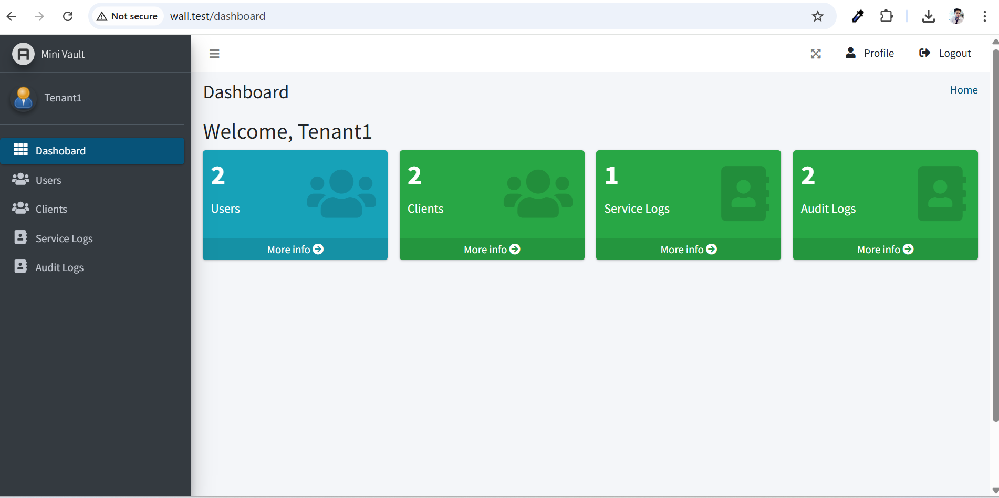
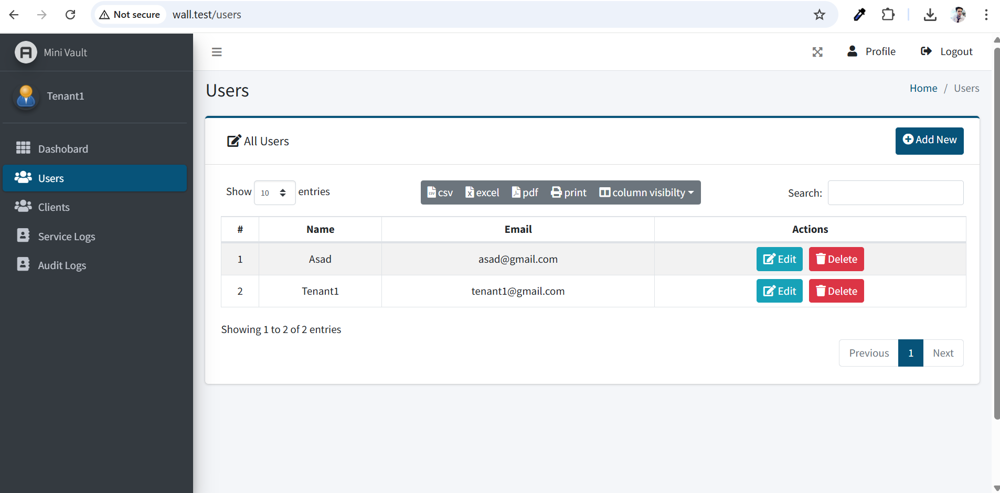
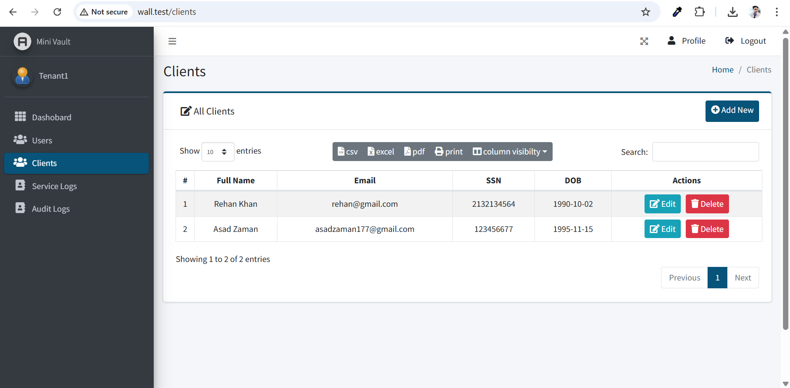
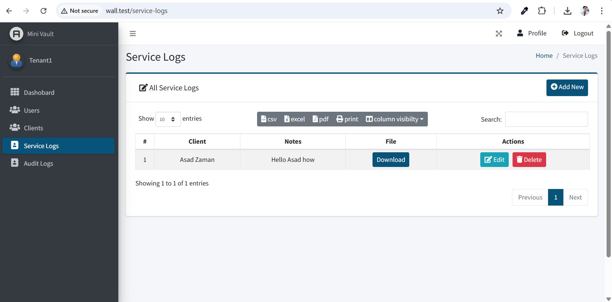
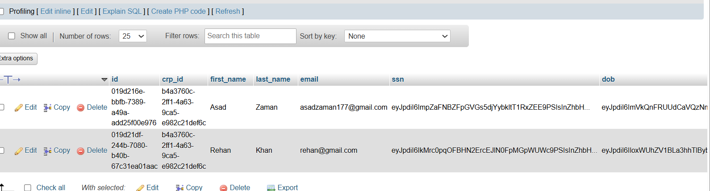
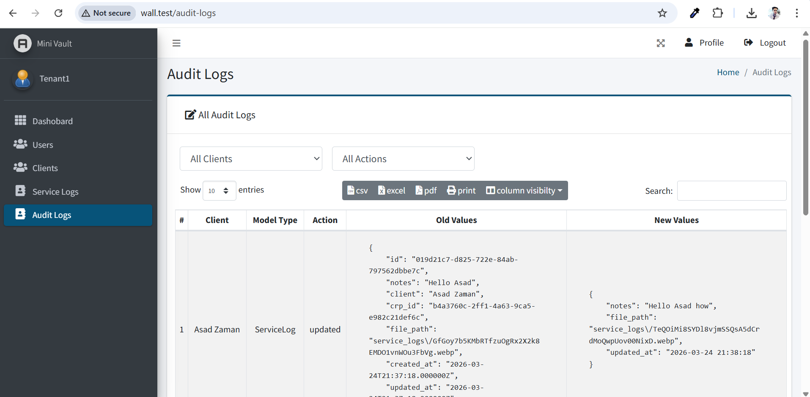

# Mini Laravel Multi-Tenant App

A minimal Laravel application built to demonstrate **multi-tenancy, PHI protection, and audit logging**.  
This project simulates a secure environment for handling sensitive client data with strict tenant isolation and compliance-focused design.

---

# 📑 Table of Contents

- [Security & Architecture](#security--architecture)  
  - [Multi-Tenancy (Tenant Isolation)](#multi-tenancy-tenant-isolation)  
  - [UUID-Based Primary Keys](#uuid-based-primary-keys)  
  - [PHI Data Encryption](#phi-data-encryption)  
  - [Audit Logging](#audit-logging)  
  - [File Handling](#file-handling)  
- [Installation](#installation)  
  - [Running Tests](#running-tests)
- [Screenshots](#screenshots)  
- [Notes](#notes)  

---

# 🔐 Security & Architecture

### ✅ Multi-Tenancy (Tenant Isolation)
- Each record is scoped using `crp_id`.
- Implemented using **Eloquent Global Scopes**.
- Ensures users can only access their own tenant data.

### ✅ UUID-Based Primary Keys
- All core entities (`users`, `clients`, `service_logs`) use **UUIDs instead of integers**.
- Prevents ID enumeration attacks.
- Improves security in distributed environments.

### ✅ PHI Data Encryption
- Sensitive fields such as:
  - `ssn`
  - `dob`
- Are encrypted using **Laravel Encrypted Casts (AES-256)**.
- Raw database queries cannot expose sensitive data.

### ✅ Audit Logging
- Implemented using **Eloquent Observers**.
- Tracks:
  - Create actions
  - Update actions
- Stores:
  - `old_values`
  - `new_values`
- Ensures traceability and accountability.

### ✅ File Handling
- Secure file uploads using Laravel Storage.
- Files linked to service logs.
- Can be extended to AWS S3 in production.

---

# 📸 Screenshots

Dashboard
<p align="center">  </p>
Users
<p align="center">  </p>
Clients
<p align="center">  </p>
Service Logs
<p align="center">  </p>
Encrypted Data in DB
<p align="center">  </p>
Audit Logs
<p align="center">  </p>

---


# ⚙️ Installation

Follow these steps to set up the project locally:

```bash
# 1. Clone the repository
git clone <your-repo-url>

# 2. Navigate into the project
cd wall

# 3. Copy environment file
cp .env.example .env

# 4. Install dependencies
composer install

# 5. Generate application key
php artisan key:generate

# 6. Run migrations with seeders
php artisan migrate:fresh --seed

# 7. Install frontend dependencies
npm install && npm run build

# 8. Serve the application
php artisan serve

## 🧪 Running Tests
php artisan test

### ✅ Test Results
PASS  Tests\Feature\Auth\AuthenticationTest
✓ login screen can be rendered 0.34s
✓ users can authenticate using the login screen 0.07s
✓ users can not authenticate with invalid password 0.23s
✓ users can logout 0.04s

PASS  Tests\Feature\Auth\EmailVerificationTest
✓ email verification screen can be rendered 0.02s
✓ email can be verified 0.02s
✓ email is not verified with invalid hash 0.10s

PASS  Tests\Feature\Auth\PasswordConfirmationTest
✓ confirm password screen can be rendered 0.02s
✓ password can be confirmed 0.02s
✓ password is not confirmed with invalid password 0.23s

PASS  Tests\Feature\Auth\PasswordResetTest
✓ reset password link screen can be rendered 0.04s
✓ reset password link can be requested 0.22s
✓ reset password screen can be rendered 0.24s
✓ password can be reset with valid token 0.26s

PASS  Tests\Feature\Auth\PasswordUpdateTest
✓ password can be updated 0.03s
✓ correct password must be provided to update password 0.02s

PASS  Tests\Feature\EncryptionTest
✓ ssn encrypted 0.03s

PASS  Tests\Feature\ServiceLogTest
✓ service log creation triggers audit log 0.05s

PASS  Tests\Feature\TenantTest
✓ tenant isolation 0.03s

Tests: 19 passed (45 assertions)
Duration: 2.28s

---


# 🚀 Notes
 - Designed as a technical assessment project.
 - Focuses on security, data isolation, and clean architecture.
 - Easily extendable to:
 - AWS S3
 - Queue-based audit logging
 - Full SaaS onboarding
